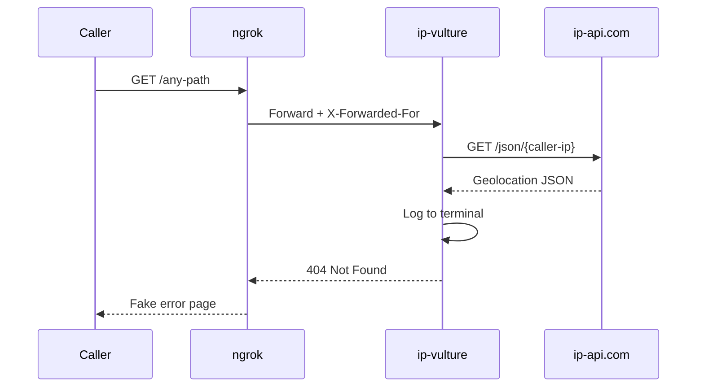

<div align="center">

<h1>ip-vulture</h1>

<strong>Share a link. Log their location. They see a dead server.</strong>

<br>
<br>

[](https://github.com/gufranco/ip-vulture/actions/workflows/ci.yml)
[](https://nodejs.org)
[](https://fastify.dev)
[](https://www.typescriptlang.org)
[](LICENSE)

</div>

---

**1** runtime dependency · **10** server disguises · **49** tests · **428** lines of source · **0** data exposed to callers

<table>
<tr>
<td width="50%" valign="top">

### Invisible Tracking
Every request resolves the caller's IP to country, city, ISP, and coordinates via ip-api.com. The geolocation appears only in your terminal logs.

</td>
<td width="50%" valign="top">

### 10 Server Disguises
Impersonate Apache, Nginx, IIS, Caddy, Lighttpd, LiteSpeed, Tomcat, OpenResty, Traefik, or HAProxy. Each template replicates real headers, content types, and HTML structure.

</td>
</tr>
<tr>
<td width="50%" valign="top">

### One-Command Tunnel
`pnpm run local` starts the server, opens an ngrok tunnel, and prints the public URL. Share it and watch the logs.

</td>
<td width="50%" valign="top">

### Proxy-Aware
`trustProxy` extracts the real client IP from `X-Forwarded-For`, whether behind ngrok, Nginx, or any reverse proxy.

</td>
</tr>
</table>

## How It Works



The caller sees what looks like a misconfigured server returning a 404. You see their IP, country, city, ISP, coordinates, and timezone in the terminal.

## Server Templates

Pick a disguise with the `SERVER_TEMPLATE` environment variable. Set it to `random` to let ip-vulture pick one at startup.

| Template | Server Header | Content-Type | Path in Body |
|:---------|:-------------|:-------------|:------------:|
| `apache` | `Apache/2.4.62 (Ubuntu)` | `text/html; charset=iso-8859-1` | Yes |
| `nginx` | `nginx/1.27.4` | `text/html` | No |
| `iis` | `Microsoft-IIS/10.0` | `text/html` | No |
| `caddy` | `Caddy` | none | No |
| `lighttpd` | `lighttpd/1.4.76` | `text/html` | No |
| `litespeed` | `LiteSpeed` | `text/html` | No |
| `tomcat` | none | `text/html;charset=utf-8` | Yes |
| `openresty` | `openresty/1.27.1.1` | `text/html` | No |
| `traefik` | none | `text/plain; charset=utf-8` | No |
| `haproxy` | none | `text/html` | No |

IIS also sets `X-Powered-By: ASP.NET`. Traefik sets `X-Content-Type-Options: nosniff`. HAProxy sets `Cache-Control: no-cache`. Every header is matched to the real server's default behavior.

## Quick Start

### Prerequisites

| Tool | Version | Install |
|:-----|:--------|:--------|
| Node.js | >= 22 | [nodejs.org](https://nodejs.org) |
| pnpm | >= 9 | `corepack enable pnpm` |
| ngrok | any | [ngrok.com](https://ngrok.com/download) |

### Setup

```bash
git clone https://github.com/gufranco/ip-vulture.git
cd ip-vulture
pnpm install
cp .env.example .env
```

### Run with ngrok

```bash
pnpm run local
```

```
========================================
  https://xxxx-xx-xx-xx-xx.ngrok-free.app
========================================
```

Share the URL. Append any path to it. Watch the terminal.

### What the caller sees

Depends on the template. With `apache` (the default):

```
Not Found

The requested URL /any-path was not found on this server.

Apache/2.4.41 (Ubuntu) Server at localhost Port 80
```

Headers match a real Apache server: `Content-Type: text/html; charset=iso-8859-1` and `Server: Apache/2.4.62 (Ubuntu)`.

### What you see

```json
{
  "id": "any-path",
  "ip": "203.0.113.50",
  "geo": {
    "country": "United States",
    "city": "New York",
    "isp": "Verizon",
    "lat": 40.7128,
    "lon": -74.006
  },
  "msg": "geolocation resolved"
}
```

## Scripts

| Command | Description |
|:--------|:------------|
| `pnpm run local` | Start server + ngrok, print public URL, stream logs |
| `pnpm dev` | Start server with auto-reload, no tunnel |
| `pnpm start` | Start server in production mode |
| `pnpm test` | Run test suite |
| `pnpm test:watch` | Run tests in watch mode |
| `pnpm run lint` | Check formatting and lint rules |
| `pnpm run lint:fix` | Auto-fix formatting and lint issues |
| `pnpm run typecheck` | Run TypeScript type checker |

## Configuration

| Variable | Default | Description |
|:---------|:--------|:------------|
| `PORT` | `3000` | Server port |
| `HOST` | `0.0.0.0` | Bind address, use `0.0.0.0` for ngrok to reach it |
| `SERVER_TEMPLATE` | `apache` | Which server to impersonate. One of: `apache`, `nginx`, `iis`, `caddy`, `lighttpd`, `litespeed`, `tomcat`, `openresty`, `traefik`, `haproxy`, `random` |

<details>
<summary><strong>Project structure</strong></summary>

```
src/
  app.ts              # Fastify app factory with trustProxy
  server.ts           # Entry point, env config, graceful shutdown
  routes/
    locate.ts         # GET / and GET /:id with geolocation + fake 404
  templates/
    template.ts       # ServerTemplate interface and ServerName enum
    registry.ts       # Template registry, resolver, and random picker
    apache.ts         # Apache 2.4.62 (Ubuntu) 404 page
    nginx.ts          # nginx 1.27.4 404 page
    iis.ts            # Microsoft-IIS/10.0 404 page
    caddy.ts          # Caddy empty response
    lighttpd.ts       # lighttpd 1.4.76 404 page
    litespeed.ts      # LiteSpeed styled 404 page
    tomcat.ts         # Apache Tomcat 10.1.34 404 page (XSS-safe)
    openresty.ts      # openresty 1.27.1.1 404 page
    traefik.ts        # Traefik plain-text 404
    haproxy.ts        # HAProxy 404 page
  __tests__/
    locate.test.ts    # Integration tests for the locate route
    registry.test.ts  # Unit tests for template resolution
    templates.test.ts # Contract tests for all 10 templates
scripts/
  local.sh            # Orchestrates server + ngrok with cleanup trap
```

</details>

<details>
<summary><strong>FAQ</strong></summary>
<br>

<details>
<summary><strong>Why does ip-api.com show a VPN location instead of the real one?</strong></summary>
<br>

ip-api.com resolves the exit IP. If the caller uses a VPN, you see the VPN server's location. There is no way around this at the network level.

</details>

<details>
<summary><strong>Why HTTP for ip-api.com instead of HTTPS?</strong></summary>
<br>

The free tier of ip-api.com only supports HTTP. The call happens server-side, so it never touches the caller's browser. Paid plans support HTTPS.

</details>

<details>
<summary><strong>What is the rate limit?</strong></summary>
<br>

ip-api.com allows 45 requests per minute on the free tier. For casual link sharing, this is more than enough.

</details>

<details>
<summary><strong>What happens when ip-api.com is down or rate-limited?</strong></summary>
<br>

The server returns a JSON 502 error. A 5-second `AbortSignal.timeout` prevents the request from hanging indefinitely.

</details>

<details>
<summary><strong>How do I add a new server template?</strong></summary>
<br>

Create a new file in `src/templates/` implementing the `ServerTemplate` interface: a `name` from the `ServerName` enum, a frozen `headers` object, and a `render(path)` function. Add the enum value to `ServerName` in `template.ts` and register it in the `templates` map in `registry.ts`.

</details>

</details>

## License

[MIT](LICENSE)
