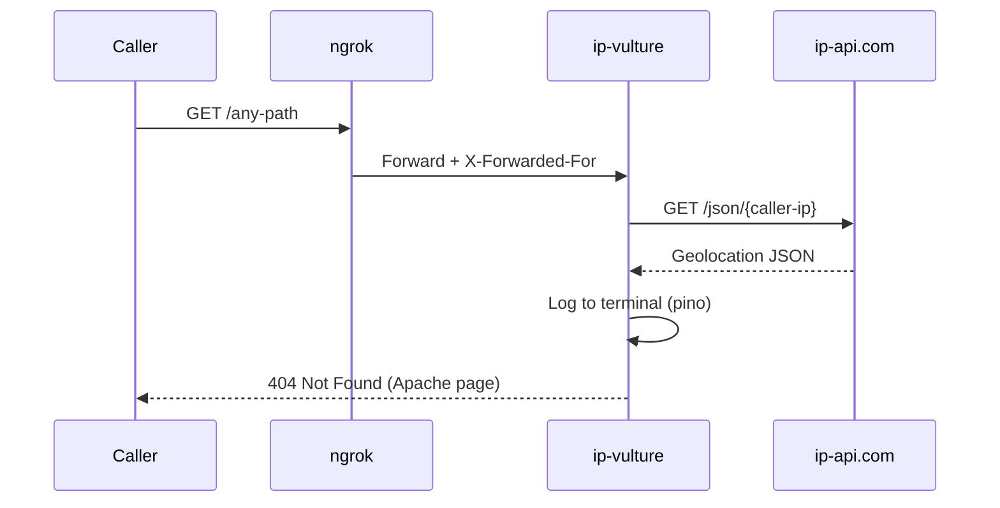

<div align="center">

<h1>ip-vulture</h1>

<strong>Share a link. Log their location. They see nothing.</strong>

<br>
<br>

[](https://nodejs.org)
[](https://fastify.dev)
[](https://www.typescriptlang.org)
[](LICENSE)

</div>

---

**1** dependency · **6** tests · **123** lines of source · **0** data exposed to callers

<table>
<tr>
<td width="50%" valign="top">

### Invisible Tracking
Every request resolves the caller's IP to country, city, ISP, and coordinates via ip-api.com. The geolocation appears in your terminal only.

</td>
<td width="50%" valign="top">

### Apache Camouflage
Callers see a standard Apache 404 page with correct headers and charset. Indistinguishable from a misconfigured server.

</td>
</tr>
<tr>
<td width="50%" valign="top">

### One-Command Tunnel
`pnpm run local` starts the server, opens an ngrok tunnel, and prints the public URL. Share it and watch the logs.

</td>
<td width="50%" valign="top">

### Proxy-Aware
`trustProxy` extracts the real client IP from `X-Forwarded-For`, whether behind ngrok, nginx, or any reverse proxy.

</td>
</tr>
</table>

## How It Works



## Quick Start

### Prerequisites

| Tool | Version | Install |
|:-----|:--------|:--------|
| Node.js | >= 22 | [nodejs.org](https://nodejs.org) |
| pnpm | >= 9 | `corepack enable pnpm` |
| ngrok | any | [ngrok.com](https://ngrok.com/download) |

### Setup

```bash
git clone https://github.com/gufranco/ip-vulture.git
cd ip-vulture
pnpm install
cp .env.example .env
```

### Run with ngrok

```bash
pnpm run local
```

```
========================================
  https://xxxx-xx-xx-xx-xx.ngrok-free.app
========================================
```

Share the URL. Watch the terminal for geolocation logs.

### What the caller sees

```
Not Found

The requested URL was not found on this server.

Apache/2.4.41 (Ubuntu) Server at localhost Port 80
```

### What you see

```json
{
  "id": "any-path",
  "ip": "203.0.113.50",
  "geo": {
    "country": "United States",
    "city": "New York",
    "isp": "Verizon",
    "lat": 40.7128,
    "lon": -74.006
  },
  "msg": "geolocation resolved"
}
```

## Scripts

| Command | Description |
|:--------|:------------|
| `pnpm run local` | Start server + ngrok, print public URL, stream logs |
| `pnpm dev` | Start server with auto-reload (no ngrok) |
| `pnpm start` | Start server |
| `pnpm test` | Run test suite |
| `pnpm run lint` | Check formatting and lint rules |
| `pnpm run lint:fix` | Auto-fix formatting and lint issues |
| `pnpm run typecheck` | Run TypeScript type checker |

## Configuration

| Variable | Default | Description |
|:---------|:--------|:------------|
| `PORT` | `3000` | Server port |
| `HOST` | `0.0.0.0` | Bind address (use `0.0.0.0` for ngrok to reach it) |

<details>
<summary><strong>Project structure</strong></summary>

```
src/
  app.ts              # Fastify app factory
  server.ts           # Entry point, env config, graceful shutdown
  routes/
    locate.ts         # GET / and GET /:id with geolocation + Apache 404
  __tests__/
    locate.test.ts    # 6 integration tests with mocked fetch
scripts/
  local.sh            # Orchestrates server + ngrok
```

</details>

<details>
<summary><strong>FAQ</strong></summary>
<br>

<details>
<summary><strong>Why does ip-api.com show a VPN location instead of the real one?</strong></summary>
<br>

ip-api.com resolves the exit IP. If the caller uses a VPN, you see the VPN server's location. There's no way around this at the network level.

</details>

<details>
<summary><strong>Why HTTP for ip-api.com instead of HTTPS?</strong></summary>
<br>

The free tier of ip-api.com only supports HTTP. The call happens server-side, so it never touches the caller's browser. Paid plans support HTTPS.

</details>

<details>
<summary><strong>What's the rate limit?</strong></summary>
<br>

ip-api.com allows 45 requests per minute on the free tier. For casual link sharing, this is more than enough.

</details>

</details>

## License

[MIT](LICENSE)
