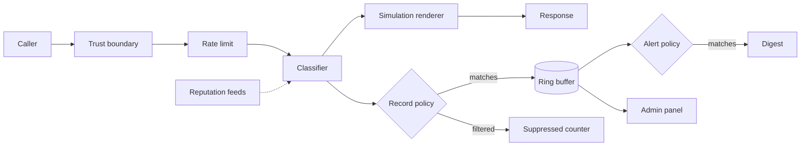

<div align="center">

<h1>ip-vulture</h1>

<strong>An HTTP server simulator. Serves faithful error responses from 1995 to today, and records who reached them, in memory only.</strong>

<br>
<br>

[](https://github.com/gufranco/ip-vulture/actions/workflows/ci.yml)
[](https://nodejs.org)
[](https://fastify.dev)
[](https://www.typescriptlang.org)
[](LICENSE)

</div>

<p align="center">
  <a href="#quick-start">Quick start</a> &nbsp;|&nbsp;
  <a href="#the-catalogue">Catalogue</a> &nbsp;|&nbsp;
  <a href="#access-monitoring">Monitoring</a> &nbsp;|&nbsp;
  <a href="docs/DATA-HANDLING.md">Data handling</a> &nbsp;|&nbsp;
  <a href="docs/DEPLOYMENT.md">Deployment</a>
</p>

---

**24** simulations · **4** decades · **9** status codes each · **2** runtime dependencies · **637** tests · **0** bytes written to disk

```console
$ curl -sSI http://localhost:3000/admin/config.php
HTTP/1.1 404 Not Found
content-type: text/html; charset=iso-8859-1
server: Apache/2.4.62 (Ubuntu)
x-simulated-response: ip-vulture; simulated-response
content-length: 406
```

Byte-faithful down to the charset, the header order, and the casing an Apache of that version actually emits. Verified against a real `httpd` container, not written from memory.

## What this is for

You point it at a port and every request gets a realistic HTTP error response instead of a framework error page. Three uses it was built for:

| Use | Why the simulator helps |
|:----|:------------------------|
| Local development | A dependency that returns a real-looking 502 or 503 on demand, without standing up the real thing |
| Integration testing | Assert your client handles an Apache 500, an nginx 502, and a Traefik plain-text 404, because they differ in ways that break parsers |
| Monitoring your own infrastructure | Put it on a host you control and watch what reaches it. Scanners find open ports quickly, and the access panel shows exactly what they asked for |

Run it on infrastructure you own or are authorized to test. The access monitor records callers, so treat it the way you would treat any server log.

## Highlights

<table>
<tr>
<td width="50%" valign="top">

### Nothing leaks the framework
Every method, every path shape, every internal error, and every throttled request renders the simulation. There is no route that returns a JSON error body.

</td>
<td width="50%" valign="top">

### Four decades of servers
NCSA httpd and CERN httpd through Envoy and Caddy, plus original early-2000s custom pages with visitor counters and webring footers.

</td>
</tr>
<tr>
<td width="50%" valign="top">

### Memory-only history
A bounded ring buffer holds technical request metadata. Nothing is written to disk, and the history dies with the process.

</td>
<td width="50%" valign="top">

### Local traffic defense
Nine public reputation and crawler feeds load at startup into a binary-searched range set, plus your own allowlist and blocklist.

</td>
</tr>
<tr>
<td width="50%" valign="top">

### Protected access panel
An HTTP Basic route shows the in-memory history. When disabled it is not registered at all, so its path is indistinguishable from any other.

</td>
<td width="50%" valign="top">

### Optional e-mail alerts
Coalesced into digests, capped per hour, and behind a circuit breaker, so a scanner sweeping 500 paths does not send 500 e-mails.

</td>
</tr>
</table>

## How a request flows


```mermaid
graph LR
    A[Caller] --> B[Trust boundary]
    B --> C[Rate limit]
    C --> D[Classifier]
    D --> E[Simulation renderer]
    E --> F[Response]
    D --> G{Record policy}
    G -->|matches| H[(Ring buffer)]
    G -->|filtered| I[Suppressed counter]
    H --> J{Alert policy}
    J -->|matches| K[Digest]
    H --> L[Admin panel]
    M[Reputation feeds] -.-> D
```

The trust boundary resolves the caller address before anything keys on it. The classifier decides whether the request is recorded, and separately whether it is worth an e-mail. The renderer is the only exit: unmatched routes, thrown errors, and throttled requests all pass through it.

## Quick start

### Prerequisites

| Tool | Version | Install |
|:-----|:--------|:--------|
| Node.js | >= 24 | [nodejs.org](https://nodejs.org) |
| pnpm | >= 10 | `corepack enable pnpm` |
| ngrok | any | [ngrok.com](https://ngrok.com/download), only for tunnel mode |
| Docker | >= 24 | [docker.com](https://docker.com), only for container mode |

### Setup

```bash
git clone https://github.com/gufranco/ip-vulture.git
cd ip-vulture
pnpm install
pnpm start
```

No `.env` file is required. The process reads real environment variables and falls back to documented defaults, so a fresh clone runs with no setup. Copy [`.env.example`](.env.example) to `.env` when you want to pin settings.

### Verify

```bash
curl http://localhost:3000/__health
# {"status":"ok"}

curl -i http://localhost:3000/anything/at/all
# HTTP/1.1 404 Not Found
# server: Apache/2.4.62 (Ubuntu)
```

> [!NOTE]
> At startup the process downloads nine public reputation feeds before accepting the first request, which takes about 1.4 seconds. On a machine with no network, set `FEEDS_ENABLED=false` to skip it.

### Expose it temporarily

```bash
pnpm run local
```

Starts the server, opens an ngrok tunnel, waits for the tunnel to publish, and prints the URL. It preflights `node` and `ngrok` and names the install command if either is missing.

> [!IMPORTANT]
> Set `TRUST_PROXY=1` behind a tunnel or reverse proxy. Left at the default `false`, the recorded address is the proxy's local socket, which is the same value for every caller. Set to `true` and any caller can choose the address you record for them.

### Run it as a container

```bash
docker compose up --build
```

Runs read-only, as a non-root user, with all capabilities dropped and the logging driver set to `none`. See [DEPLOYMENT.md](docs/DEPLOYMENT.md).

## The catalogue

24 simulations across four decades. Each renders 9 status codes: 400, 401, 403, 404, 410, 500, 502, 503, and 504.

| Era | Count | Simulations |
|:----|:-----:|:------------|
| 1990s | 5 | NCSA httpd 1.5.2, CERN httpd 3.0A, Apache 1.3.42, Microsoft IIS 4.0, Netscape Enterprise 3.6 |
| 2000s | 8 | Apache 2.0.63, Microsoft IIS 6.0, nginx 0.7.65, Zeus 4.3, plus 4 creative pages |
| 2010s | 7 | Apache 2.4.62, nginx 1.27.4, OpenResty 1.27.1.1, IIS 10.0, Tomcat 10.1.34, lighttpd 1.4.76, LiteSpeed |
| 2020s | 4 | Caddy 2, Traefik 3, HAProxy 3, Envoy 1.33 |

Period markers are reproduced, not approximated: the 1990s entries emit no DOCTYPE and use uppercase tags, the 2000s entries use HTML 4.01 with `iso-8859-1`, and the modern edge proxies return minimal or empty bodies.

### The creative genre

Four original pages in early-2000s style, for when a stock server page is not the thing you want to look at.

| Id | What it is |
|:---|:-----------|
| `construction-zone` | A 2001 personal page with an animated-warning motif, visitor counter, and guestbook link |
| `lost-in-space` | A 2003 hobby site with an inline-SVG flying saucer |
| `webring-hub` | A 2002 fan site with a webring footer |
| `cyber-cafe` | A 2000 small-business site in a fixed 760-pixel table layout |

These are original works written from period conventions. No entry reproduces a specific real site, carries real branding, or ships a binary asset: every graphic is inline SVG or CSS, so each page is reviewable as text in a diff.

### Picking one

```bash
SERVER_TEMPLATE=apache-1.3        # a specific simulation
SERVER_TEMPLATE=random            # pick one at startup
SERVER_TEMPLATE=random RANDOM_SCOPE=request   # pick per request
SERVER_TEMPLATE=random SIMULATION_ERA=1990s   # narrow the pool
SERVER_TEMPLATE=random SIMULATION_GENRE=creative
```

`RANDOM_SCOPE=startup`, the default, picks once per process. `request` picks independently for every request, which is what you want when exercising a client against varied responses in one run.

## The disclosure marker

Responses can carry `X-Simulated-Response: ip-vulture; simulated-response`, and HTML bodies a trailing comment saying the same thing. This is **off by default** so responses stay byte-faithful, and is controlled by `SIMULATION_DISCLOSURE`.

| Value | Behavior |
|:------|:---------|
| `both` | Header and HTML comment. The default |
| `header` | Header only |
| `comment` | HTML comment only, HTML bodies only |
| `off` | Neither |

The marker exists so a simulated response is never mistaken for a real one by whoever finds it. It also costs byte-exact fidelity, which is the whole tension: a real Apache does not send that header.

> [!IMPORTANT]
> The default is `off`, so nothing in the response marks it as simulated. That is what makes the output byte-faithful, and it is the right default for testing a client against realistic server behavior. It also means anyone who finds the server has no machine-readable signal that it is a simulation. Run it only on infrastructure you own or are authorized to test, and set `SIMULATION_DISCLOSURE=both` when you want the marker back.

## Access monitoring

Every request that passes the record policy becomes one entry in a fixed-capacity ring buffer, default 1000. Twelve fields, all technical request metadata:

`timestamp`, `method`, `path`, `statusCode`, `ip`, `userAgent`, `referer`, `host`, `protocol`, `durationMs`, `simulationId`, `classification`

The query string is stripped before the path is stored, so a token passed as a query parameter is never recorded. No request bodies, no cookies, no authorization headers, and no header outside that list. A test fails if any other field is captured.

Full detail in [DATA-HANDLING.md](docs/DATA-HANDLING.md): what is captured, how long it survives, and the two paths by which anything leaves the machine.

### The admin panel

```bash
ADMIN_ENABLED=true
ADMIN_USER=ops
ADMIN_PASSWORD=<from your secret store>
```

`/__admin` renders the history as a table, `/__admin/json` serves it for scripting. Credentials come from the environment and are compared with a timing-safe digest. Every field is HTML-escaped before rendering, because user agents and referers are attacker-controlled and the panel is where they get read back.

When `ADMIN_ENABLED` is false the routes are never registered, so the path returns the ordinary simulated page and its existence is not observable.

## Traffic classification

Every request is classified as `human`, `bot`, `scanner`, or `blocked` from local signals only.

| Signal | Source |
|:-------|:-------|
| Declared crawler user agent | Local pattern list |
| Absent user agent or `Accept` header | Request headers |
| Probe paths such as `/.env`, `/.git/config`, `/wp-login.php` | Local path list |
| Scanner tooling such as sqlmap, nikto, nuclei | Local pattern list |
| Operator allowlist and blocklist | `IP_ALLOWLIST`, `IP_BLOCKLIST` |
| Public reputation feeds | Downloaded at startup |

A user agent claiming to be Googlebot from an address outside Google's published ranges is classified as a scanner, which neither fact establishes alone.

Two policies decide what happens next, independently:

```bash
RECORD_POLICY=human,bot,scanner   # what gets stored, default
ALERT_POLICY=human                # what gets e-mailed, default
```

Suppressed requests increment a counter and store nothing, so an empty panel still distinguishes "no traffic arrived" from "everything was filtered".

### The feeds

Nine public lists, all enabled by default, fetched in parallel at startup and refreshed every 12 hours. They produce roughly 29,000 merged address ranges, queried by binary search.

| Feed | Role |
|:-----|:-----|
| Spamhaus DROP, FireHOL level 1, blocklist.de, CINS army list | Reputation |
| Tor bulk exit list | Reputation |
| Googlebot, Bingbot, GPTBot, Cloudflare ranges | Crawler verification |

They are held in memory and never cached to disk, which is why a restart re-downloads them. A feed that fails is logged by name and startup proceeds with what loaded; set `FEEDS_REQUIRED=true` to refuse to start unfiltered instead. Licences are named in [DATA-HANDLING.md](docs/DATA-HANDLING.md).

## E-mail alerts

Off by default. When enabled, records matching `ALERT_POLICY` are coalesced over a window into one digest.

```bash
ALERT_ENABLED=true
ALERT_FROM=alerts@example.com
ALERT_TO=you@example.com
SMTP_HOST=smtp.example.com
```

`ALERT_WINDOW_SECONDS` defaults to 60, `ALERT_MAX_PER_HOUR` to 20, and consecutive SMTP failures open a circuit breaker. Delivery is fire-and-forget: a mail failure can never delay or break a response. Set the window to 0 for one message per access.

## Geolocation

Off by default. When `GEO_ENABLED=true`, the caller's address is sent to ip-api.com to resolve country, city, and ISP into the operator log.

This is the one outbound flow that carries information about your callers, which is why it is opt-in. Reserved, private, and loopback addresses are never sent. A per-address cache, a process-wide token bucket, and single-flight collapsing bound how many lookups happen, so a scanner sweeping a thousand paths costs one lookup.

## Configuration

47 variables, all documented in [`.env.example`](.env.example). The ones that change behavior most:

| Variable | Default | Description |
|:---------|:--------|:------------|
| `PORT` | `3000` | Listen port |
| `TRUST_PROXY` | `false` | `false`, a hop count, or a CIDR list. Must match your real topology |
| `SERVER_TEMPLATE` | `apache` | A simulation id, or `random` |
| `RANDOM_SCOPE` | `startup` | `startup` or `request` |
| `SIMULATION_DISCLOSURE` | `off` | `header`, `comment`, `both`, or `off` |
| `ACCESS_LOG_CAPACITY` | `1000` | Ring buffer size |
| `RECORD_POLICY` | `human,bot,scanner` | Which classifications are stored |
| `ALERT_POLICY` | `human` | Which classifications are e-mailed |
| `FEEDS_ENABLED` | `true` | Download reputation feeds at startup |
| `GEO_ENABLED` | `false` | Send caller addresses to ip-api.com |
| `ADMIN_ENABLED` | `false` | Register the admin panel |

Every value is validated at startup, and all failures are reported at once rather than one restart at a time.

## Development

| Command | Description |
|:--------|:------------|
| `pnpm start` | Start the server |
| `pnpm dev` | Start with auto-reload |
| `pnpm run local` | Start with an ngrok tunnel |
| `pnpm test` | Run the suite |
| `pnpm test --coverage` | Run with coverage and enforce thresholds |
| `pnpm run lint` | Check formatting and lint rules |
| `pnpm run lint:fix` | Apply formatting and lint fixes |
| `pnpm run typecheck` | Run the type checker |

### Adding a simulation

Add an entry to the era file under [`src/simulations/vendor/`](src/simulations/vendor) or [`src/simulations/creative/`](src/simulations/creative), implementing `id`, `displayName`, `era`, `genre`, `statusCodes`, `headers(context)`, and `render(context)`. Register it in the era's exported array. The contract tests in [`src/simulations/__tests__/catalogue.test.ts`](src/simulations/__tests__/catalogue.test.ts) then cover it automatically across every status code, including the escaping check.

Escape anything from `context` with `escapeHtml` from [`src/simulations/escape.ts`](src/simulations/escape.ts). A test asserts no rendered body contains an unescaped tag from the request.

<details>
<summary><strong>Project structure</strong></summary>

```
src/
  app.ts                  Fastify wiring, catch-all pipeline, access recording
  bootstrap.ts            Startup: config, feed load, dependency composition
  server.ts               Entry point, signals, graceful shutdown
  config/                 Parsing primitives and the validated schema
  simulations/            Catalogue, renderer, disclosure, escaping
    vendor/               Server pages by era
    creative/             Original period-styled custom pages
  monitoring/             In-memory ring buffer
  defense/                Traffic classifier and reputation feeds
  net/                    Address parsing, CIDR sets, reserved ranges
  geo/                    Budget, cache, and lookup
  alerts/                 Digest coalescing and the SMTP transport
  routes/                 Admin panel
```

</details>

## Design decisions

- **One render path for every exit.** Unmatched routes, thrown errors, and rate-limit rejections all pass through the same function. This is why a single test asserting no response body contains `"statusCode"` covers the whole surface.
- **Trust is off by default.** Four features key on the caller address. A wrong value corrupts all four silently, so the operator has to state their topology rather than inherit a guess.
- **Recording and alerting are separate policies.** Recording bot traffic without being e-mailed about it is the common case, and one policy could not express it.
- **The suppressed counter stores nothing.** Without it, a quiet panel is ambiguous between no traffic and total filtering, which need opposite responses.
- **Feeds block startup.** A background first fetch would leave the first seconds unfiltered, and a freshly restarted process is exactly when probing is most likely.
- **SMTP is hand-rolled behind an interface.** Keeps the runtime dependency count at two. Swapping in a mail library is an adapter, not a rewrite.

<details>
<summary><strong>FAQ</strong></summary>
<br>

<details>
<summary><strong>Does anything get written to disk?</strong></summary>
<br>

No. The access history is a ring buffer in memory and dies with the process. The one way persistence returns is your container logging driver: under the default `json-file` driver the runtime writes stdout to the host. The compose file sets it to `none` for that reason. See [DATA-HANDLING.md](docs/DATA-HANDLING.md).

</details>

<details>
<summary><strong>Does the response carry anything marking it as simulated?</strong></summary>
<br>

It does not, by default. `SIMULATION_DISCLOSURE` is `off` so responses match the real server byte for byte. Set it to `both` when you want every response marked as a simulation. See [The disclosure marker](#the-disclosure-marker).

</details>

<details>
<summary><strong>Why is geolocation off by default?</strong></summary>
<br>

It is the only feature that sends information about your callers to a third party, over plaintext HTTP, because the free tier has no TLS. A flow like that should be a decision rather than a default.

</details>

<details>
<summary><strong>What happens if a reputation feed is down at startup?</strong></summary>
<br>

The failure is logged by name and startup proceeds with whatever loaded. A total parallel-fetch budget caps boot time regardless of any single host. Set `FEEDS_REQUIRED=true` to refuse to start unfiltered, or `FEEDS_ENABLED=false` to skip feeds entirely for offline work.

</details>

<details>
<summary><strong>Can the admin panel be discovered?</strong></summary>
<br>

Not when it is disabled: the routes are never registered, so the path renders the ordinary simulated page with the same status and content type as any other. When enabled, serve it over TLS, since HTTP Basic sends the password base64-encoded on every request.

</details>

<details>
<summary><strong>How faithful are the old pages?</strong></summary>
<br>

Faithful to period conventions rather than copied from any specific site. The 1990s entries emit no DOCTYPE and use uppercase tags. Apache entries declare `iso-8859-1` and the renderer actually encodes the body in that charset, so an accented path renders correctly instead of as mojibake. Header order and the HTTP version cannot be forged without dropping below Fastify.

</details>

</details>

## License

[MIT](LICENSE)
